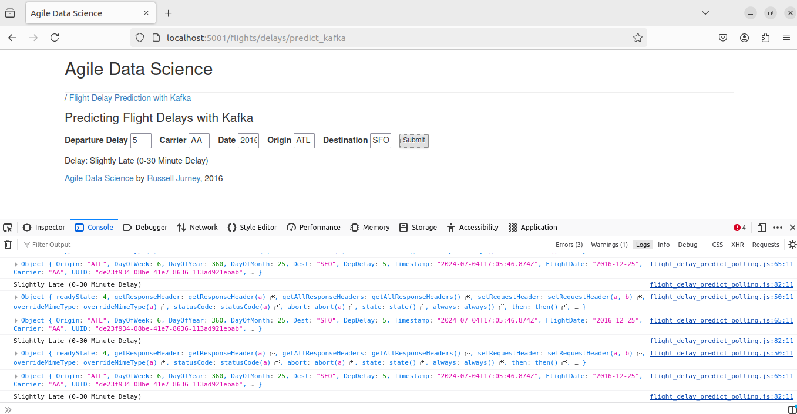
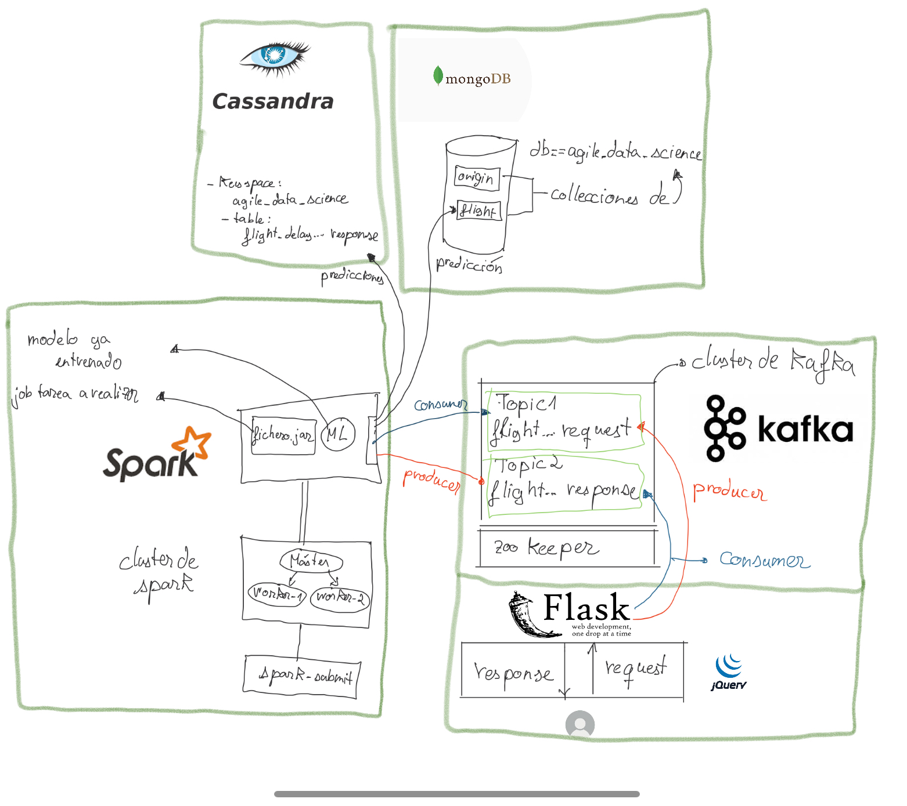
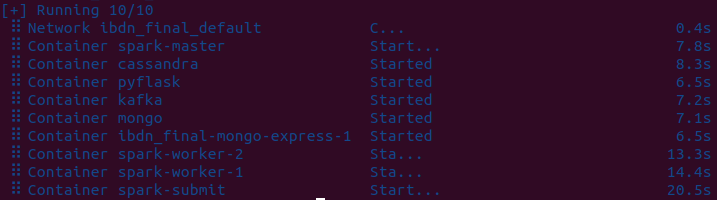
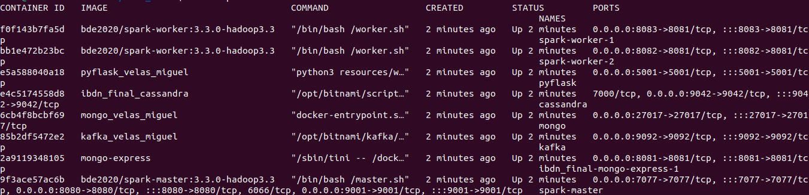
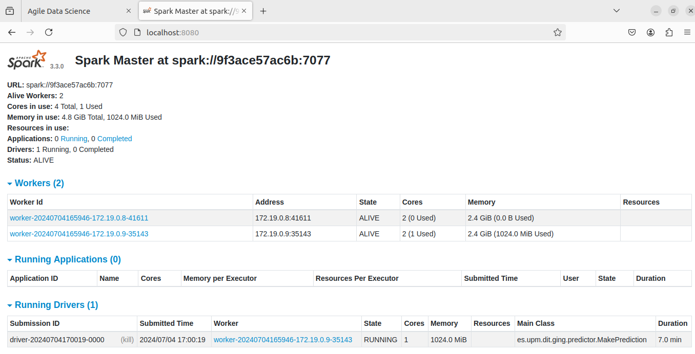
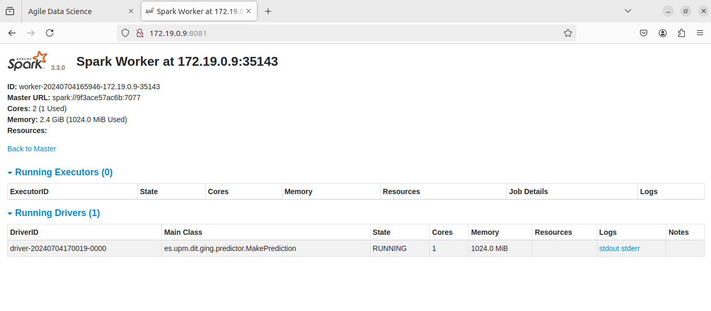
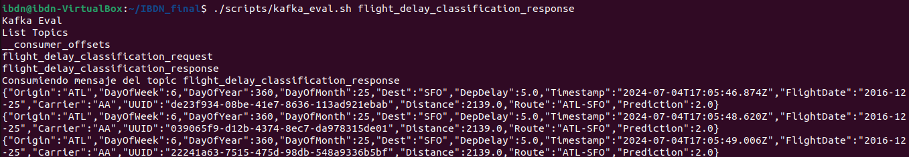
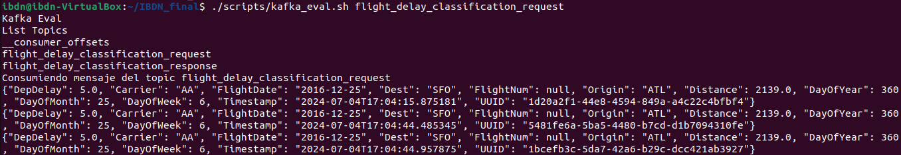
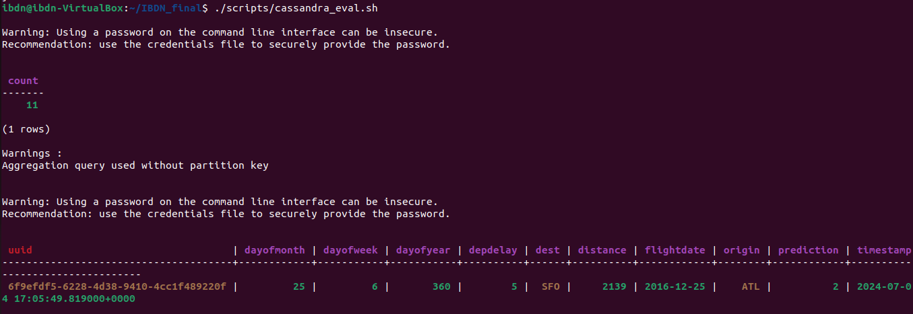
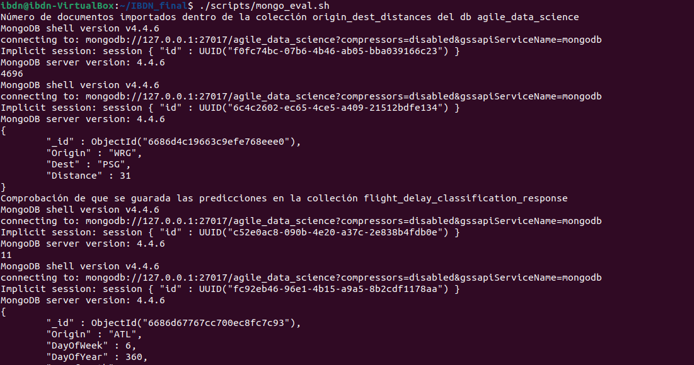

# Predicción de retrasos de vuelo

Vamos a desplegar una aplicación que prediga el 'delay' de los vuelos según las variables de entrada que nos facilite el ususario final.





Para desplegar dicha aplicación, vamos a utilizar la herramienta Docker. [Docker](https://www.docker.com/) es un proyecto de código abierto que automatiza el despliegue de aplicaciones dentro de contenedores de software, proporcionando una capa adicional de abstracción y automatización de virtualización de aplicaciones en múltiples sistemas operativos.

# Estructura del proyecto

El proyecto se compone por los diversos servicios que quedan reflejados dentro del [docker-compose.yaml](docker-compose.yaml). Más adelante, se detallarán cada uno de los servicios que componen el proyecto. Antes, vamos hacer referencia al esquema donde queda reflejada la conexión y el objeto de cada contendor.





Relacionado a spark encontramos el contenedor `spark-master`, `spark-worker-1`, `spark-worker-2` y `spark-submit`. El servicio de spark-submit es el encargado de lanzar el job de spark que incluye la inferencia sobre un modelo ya entrenado (en el repositorio se encuentra el modelo entrenado), para ejecutar dicha inferencia los datos a inferir se encuentran dentro del servicio de `kafka` en el topico *flight_delay_classification_request*. De ahí que el trabajo de job lance un consumidor de kafka para leer los datos a inferir en dicho tópico, una vez predicho el retraso del vuelo, se envía el resultado al tópico *flight_delay_classification_response* (crea un producer para publicar mensajes a kafka), guarda los resultados en el servicio de `cassandra` y `mongo`.

El servicio de `pyflask` como ya hemos explicado anterioremente, genera  un producer que publica los requests del usuario al topico *flight_delay_classification_request* de kafka, y un consumidor que lee el último mensaje del tópico *flight_delay_classification_response* para mostrarlos al usuario.


# Despliegue de la aplicación

Clonamos el repositorio

```bash
git clone https://github.com/andresvelas/IBDN_final/
```
UNa vez desplegado el repositorio, nos movemos a la carpeta del proyecto

```bash
cd IBDN_final
```

Y ejecutamos el siguiente comando para desplegar la aplicación

```bash
docker-compose up -d --build
```


-d para que se ejecute en segundo plano y --build para que se construyan las imágenes de los contenedores.

Podemos observar como se han creado todos los contendores:
```bash
docker ps
```


Una vez desplegado, podemos acceder a la aplicación a través de la siguiente URL:
[http://localhost:5001/flights/delays/predict_kafka](http://localhost:5001/flights/delays/predict_kafka)

y nos aparecerá la siguiente pantalla:


# Comprobación de los servicios

## Spark
Dentro del navegador accedemos a la siguiente URL para comprobar que los servicios de spark están funcionando correctamente:
[http://localhost:8080/](http://localhost:8080/)


Observamos los dos workers como se mantienen **ALIVE**,y uno de ellos esta corriendo **RUNNING**, también nos especifica la clase ...MakePrediction.
Vamos a inspeccionar, pinchar sobre el worker en ejecución:



## Kafka

Hemos creado un fichero dentro de la carpeta script que recibe como parámetro el nombre del topic, entonces se lanzará un consumidor de kafka para leer los mensajes del topic que le pasemos como parámetro.
También, antes de lanzar el consumidor nos devuelve los topicos que hay en kafka.

```bash
./script/kafka_eval.sh flight_delay_classification_response
```
Nos debería aparecer algo similar a esto:



```bash
./script/kafka_eval.sh flight_delay_classification_request
```
Nos debería aparecer algo similar a esto:



## Cassandra

Para comprobar que el servicio de cassandra está funcionando correctamente, ejecutamos el siguiente comando:

```bash
./script/cassandra_eval.sh
```
En este caso hay que realizar un submit para que se ejecute el job de spark y se guarden los resultados en cassandra.

Un ejemplo de lo que nos debería aparecer:



## Mongo

Igual que en cassandra para comprobar que el servicio de mongo está funcionando correctamente, ejecutamos el siguiente comando:

```bash
./script/mongo_eval.sh
```
Hay que realizar un submit si no se ha realizado después de haber lanzado los contenedores.
En este caso tenemos dos colleciones: origin_dest_distances y flight_delay_classification_response.

Un ejemplo de lo que nos debería aparecer:



En vez de haver creado dicho fichero .sh para evaluar el correcto funcionamiento de mongo podríamos haber entrado a mongo express, que nos facilita una interfaz de escritura para el administrador.
Para ello accedemos a la URL [http://localhost:8081/](http://localhost:8081/)

[imagen](images/mongo_express.png)

yyy
